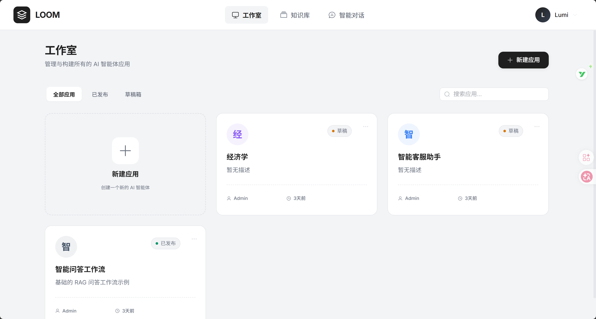
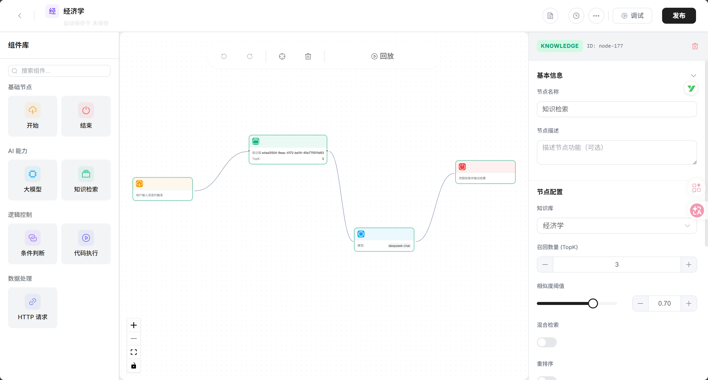
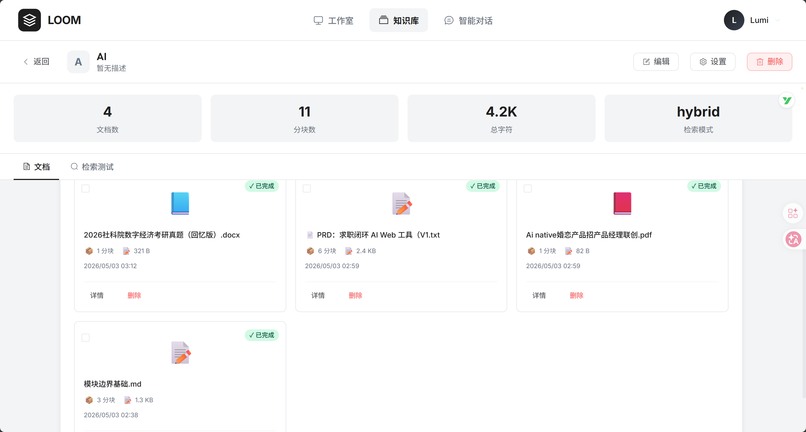
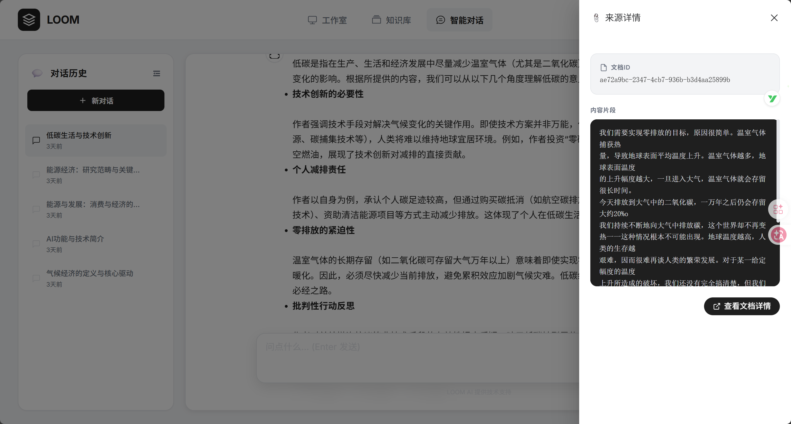
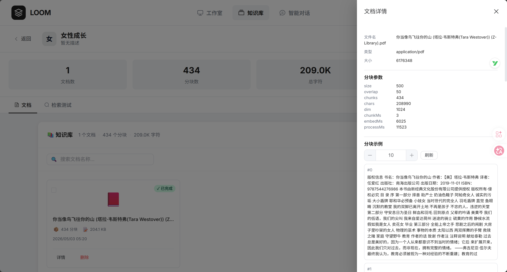
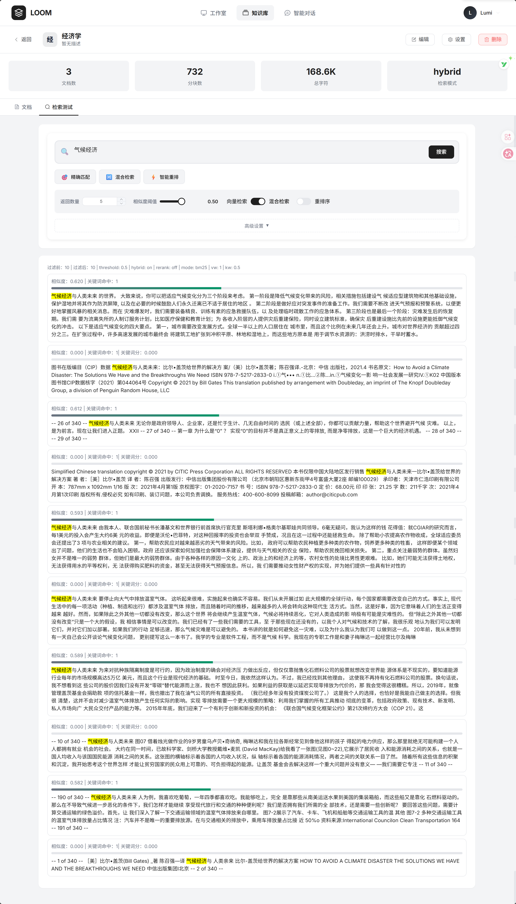
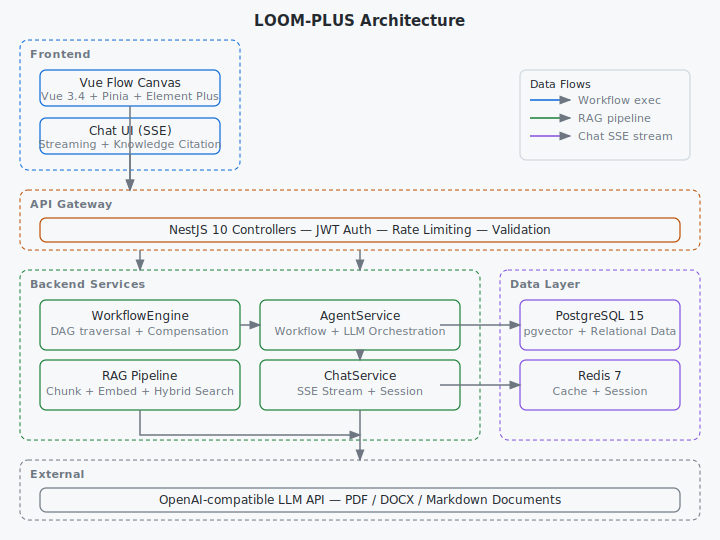

# LOOM-PLUS

> 可视化 AI 工作流编排引擎——支持拖拽式 DAG 画布、知识库 RAG 检索与 SSE 流式对话的完整前后端系统。
>
> 演进路径：基于 AgentFlow Studio 骨架进行深度重构，融合 LOOM 织机核心模块（Undo/Redo、Markdown 处理、混合检索、视觉设计系统），持续开发维护。

## 截图



| 工作流编排 | 知识库管理 |
|-----------|-----------|
|  |  |

| 智能对话 | 文档分块 |
|---------|---------|
|  |  |



## 架构



## 技术栈

| 层级 | 技术 | 版本 |
|------|------|------|
| 前端框架 | Vue | 3.4.34 |
| 状态管理 | Pinia | 2.1.7 |
| 工作流画布 | Vue Flow | 1.41.2 |
| UI 组件库 | Element Plus | 2.7.8 |
| 构建工具 | Vite | 5.3.5 |
| 类型系统 | TypeScript | 5.5.4 |
| 后端框架 | NestJS | 10.3 |
| ORM | TypeORM | 0.3.20 |
| 数据库 | PostgreSQL (pgvector) | 15 |
| 缓存 | Redis | 7 |
| 认证 | Passport + JWT | 11.0 / 4.0 |
| AI SDK | OpenAI Node SDK | 4.52 |
| 容器化 | Docker Compose | 3.8 |

## 技术实现

**前端**：基于 Vue Flow 的拖拽画布组件设计（7 种节点类型 + 属性面板）；Pinia 状态管理含 Undo/Redo 历史插件（Command Pattern，最多 50 步）；2s 防抖自动保存机制；SSE 流式对话 UI；知识库文档管理界面。

**后端**：工作流 DAG 遍历引擎 + 补偿执行器（compensate/skip/rollback 三策略）；RAG 管道——文档解析（PDF/DOCX/Markdown）、三种切块策略、向量嵌入、RRF 混合检索（向量 + 关键词融合）；SSE 流式聊天接口；JWT 认证模块。

**基础设施**：Docker Compose 全栈编排（PostgreSQL + pgvector / Redis / 前后端服务）；GitHub Actions CI 流水线（lint → build → test）。

## 核心功能

- **可视化工作流**：拖拽编排 7 种节点（trigger / LLM / knowledge / condition / code / http / end），变量系统支持 `{{var}}` 引用和类型推断
- **知识库 RAG**：支持 PDF / DOCX / Markdown 上传，fixed / semantic / recursive 三种切块策略，中文语义分隔符
- **混合检索**：RRF 融合向量相似度 + 关键词匹配，temperature 参数透传
- **补偿执行**：节点失败时自动执行 compensate / skip / rollback，6 种补偿动作
- **SSE 流式输出**：实时对话体验，引用来源可跳转

## 快速启动

### 前置要求

- [Node.js](https://nodejs.org/) 18+
- [pnpm](https://pnpm.io/) 10+
- [Docker Desktop](https://www.docker.com/products/docker-desktop/)

### 环境配置

```bash
cp backend/.env.example backend/.env
# 编辑 backend/.env，填入你的 API key（DeepSeek / OpenAI / SiliconFlow 等）
```

### 一键启动

**Windows：**
```bash
start.bat
```

**macOS / Linux：**
```bash
chmod +x start.sh
./start.sh
```

### 手动启动

```bash
# 1. 启动基础设施
docker-compose up -d postgres redis

# 2. 启动后端（终端 1）
cd backend && pnpm install && pnpm start:dev

# 3. 启动前端（终端 2）
cd frontend && pnpm install && pnpm dev
```

后端 http://localhost:3000 · 前端 http://localhost:5173

## 学到了什么

这些不是事后总结，是真实踩坑后留下的 commit：

1. **pdf-parse 2.x 的破坏性升级**（commit `e907bc1`）：部署后发现文档解析失败，排查半天发现 `pdf-parse@2.x` 改了 API 签名，测试环境用的 `1.x` 缓存。教训：Node.js 依赖要锁定次要版本，`package.json` 里的 `^` 在服务端是地雷。

2. **向量维度从 1536 降到 1024**（commit `499254f`）：一开始按 OpenAI text-embedding-3 的 1536 维建表，换模型后维度不匹配直接报错。后来把维度独立成配置项，表结构用 migration 管理而不是 TypeORM `synchronize: true`。

3. **temperature 参数不是透传就行**（commit `20ec735`）：LLM 节点需要让用户调 temperature，但工作流执行有重试逻辑——重试时不能复用同一个 temperature（会导致结果雷同）。最后设计成：重试时 temperature 在基础值上小幅抖动，既保持多样性又不偏离用户意图。

4. **条件节点的分隔符陷阱**（commit `ad2e481`）：条件节点最初只支持精确匹配，用户反馈"包含"场景更多。加 `separator` 字段时才发现，中文按字分词和按词分词的结果天差地别。最后把分隔符做成可选配置，默认用正则 `/[\s,，]+/` 兼容中英文。

## 许可证

MIT
