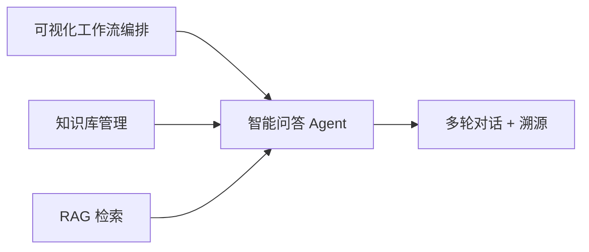
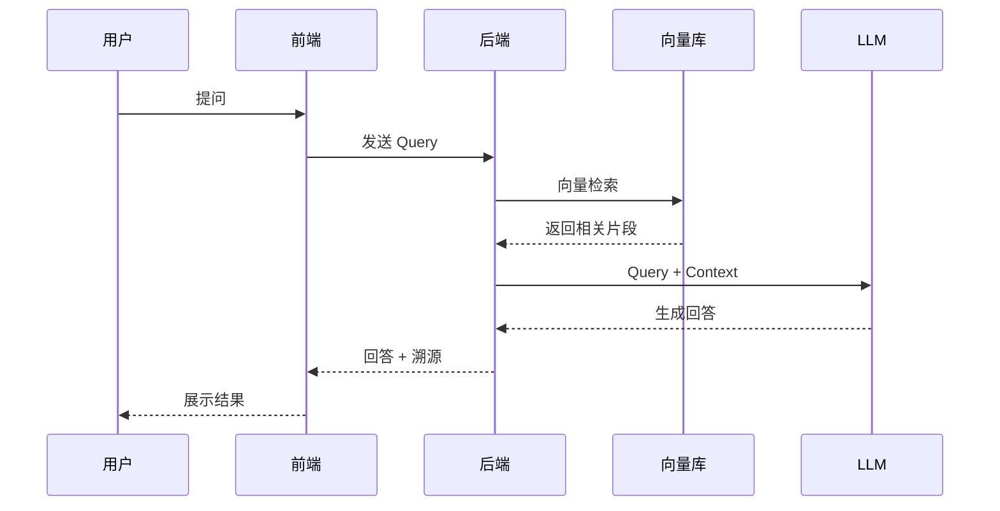

# 简化版 Coze 智能体平台 - 产品需求文档 (PRD)

## 1. 产品概述

### 1.1 产品愿景

打造一个轻量化、高还原度的 Coze 智能体平台 Demo，让用户通过**可视化拖拽编排**工作流、知识库构建与 RAG 检索，无需复杂编码即可快速搭建智能问答 Agent。

### 1.2 目标用户

| 用户类型  | 核心需求                                |
| --------- | --------------------------------------- |
| 开发者    | 快速搭建 AI Agent，理解全链路原理       |
| 产品经理  | 通过可视化方式设计业务流程              |
| Day0 学员 | 深度掌握 Agent 全链路逻辑及全栈集成技巧 |

### 1.3 产品定位

```
轻量化 Demo → 核心功能MVP → 可演示、可讲解、可复现
```

---

## 2. 核心功能矩阵



### 2.1 功能优先级

| 优先级 | 功能模块         | 说明                             |
| ------ | ---------------- | -------------------------------- |
| P0     | 可视化工作流编排 | **核心功能**，必须完整实现       |
| P0     | 知识库管理       | **核心功能**，支持文本上传和 RAG |
| P0     | 智能问答 Agent   | **核心功能**，多轮对话 + 溯源    |
| P1     | 工作流执行日志   | 帮助调试和展示                   |
| P2     | 用户认证         | 可选，极简实现即可               |

---

## 3. 功能详细需求

### 3.1 可视化工作流编排

#### 3.1.1 功能描述

提供拖拽式画布，支持节点的添加、连接、配置与保存。

#### 3.1.2 节点类型

| 节点类型         | 图标 | 功能说明                   |
| ---------------- | ---- | -------------------------- |
| **触发节点**     | ▶️   | 工作流入口，可配置触发条件 |
| **LLM 节点**     | 🤖   | 调用大模型进行推理         |
| **知识检索节点** | 📚   | 从知识库检索相关内容       |
| **条件分支节点** | ⚡   | 根据条件分流执行路径       |
| **代码节点**     | 💻   | 执行自定义代码逻辑         |
| **结束节点**     | ⏹️   | 工作流出口，返回结果       |

#### 3.1.3 用户故事

```
作为用户，我希望能够：
- 从左侧节点面板拖拽节点到画布
- 通过连线连接节点建立执行顺序
- 双击节点打开配置面板
- 保存工作流到后端
- 一键运行工作流并查看执行结果
```

#### 3.1.4 交互原型

```
┌─────────────────────────────────────────────────────────────┐
│  节点面板  │              画布区域                           │
│ ┌────────┐ │  ┌──────┐     ┌──────┐     ┌──────┐           │
│ │ 触发   │ │  │ 触发  │────▶│ LLM  │────▶│ 结束  │           │
│ ├────────┤ │  └──────┘     └──────┘     └──────┘           │
│ │ LLM    │ │                   │                           │
│ ├────────┤ │                   ▼                           │
│ │ 知识库 │ │              ┌──────┐                          │
│ ├────────┤ │              │ 知识库│                          │
│ │ 分支   │ │              └──────┘                          │
│ └────────┘ │                                               │
├─────────────┴───────────────────────────────────────────────┤
│  工具栏：[ 保存 ] [ 运行 ] [ 清空 ] [ 撤销 ]                   │
└─────────────────────────────────────────────────────────────┘
```

---

### 3.2 知识库管理

#### 3.2.1 功能描述

支持文本/文件上传，实现基于 RAG 的精准检索。

#### 3.2.2 支持格式

| 格式   | 处理方式             |
| ------ | -------------------- |
| `.txt` | 直接读取文本内容     |
| `.md`  | 解析 Markdown 结构   |
| `.pdf` | 提取文本内容（可选） |

#### 3.2.3 用户故事

```
作为用户，我希望能够：
- 上传文本文件到知识库
- 查看知识库中的文档列表
- 删除不需要的文档
- 在问答时自动检索相关知识
```

#### 3.2.4 RAG 流程



---

### 3.3 智能问答 Agent

#### 3.3.1 功能描述

支持多轮对话、回答溯源，对接 LLM 实现智能响应。

#### 3.3.2 核心能力

| 能力         | 说明                                |
| ------------ | ----------------------------------- |
| **多轮对话** | 维护会话历史，理解上下文            |
| **回答溯源** | 标记引用来源（知识库 ID / 节点 ID） |
| **流式输出** | 打字机效果，提升用户体验            |

#### 3.3.3 用户故事

```

#### 3.2.5 检索与分块参数（新增）

为保证检索质量与可解释性，系统提供以下可配置参数：

- `topK`：检索返回数量
- `scoreThreshold`：相似度阈值
- `hybrid`：混合检索（关键词 + 向量）
- `rerank`：重排序（融合分降序）
- `chunkSize`：上传分块大小
- `overlap`：分块重叠长度

> [!IMPORTANT]
> 在 Demo 演示中，应展示至少一次“分块参数调整”对检索结果的影响。
作为用户，我希望能够：
- 在对话界面与 Agent 进行多轮对话
- 看到回答中引用的知识来源
- 实时看到 AI 的流式输出
- 清空对话历史重新开始
```

#### 3.3.4 对话界面原型

```
┌─────────────────────────────────────────────┐
│                Agent 对话                    │
├─────────────────────────────────────────────┤
│  🤖 你好！我是你的智能助手，请问有什么可以帮你？ │
│                                              │
│  👤 这个项目的技术栈是什么？                    │
│                                              │
│  🤖 根据项目文档，技术栈包括：                  │
│     - 前端：Vue 3 + Vite                     │
│     - 后端：NestJS + PostgreSQL              │
│     📎 来源：知识库 #doc-001                  │
│                                              │
├─────────────────────────────────────────────┤
│  📝 输入消息...                    [ 发送 ]   │
└─────────────────────────────────────────────┘
```

---

## 4. 非功能需求

### 4.1 性能要求

| 指标         | 要求 |
| ------------ | ---- |
| 首屏加载     | < 3s |
| 工作流保存   | < 1s |
| RAG 检索     | < 2s |
| LLM 首字响应 | < 3s |

### 4.2 兼容性要求

| 类型   | 要求                             |
| ------ | -------------------------------- |
| 浏览器 | Chrome 90+, Edge 90+, Safari 15+ |
| 分辨率 | 1280×720 及以上                  |

---

## 5. 数据模型

### 5.1 工作流数据结构

```json
{
  "id": "workflow-001",
  "name": "智能问答流程",
  "nodes": [
    {
      "id": "node-1",
      "type": "trigger",
      "position": { "x": 100, "y": 100 },
      "config": {}
    },
    {
      "id": "node-2",
      "type": "llm",
      "position": { "x": 300, "y": 100 },
      "config": {
        "model": "gpt-4o-mini",
        "prompt": "你是一个智能助手"
      }
    }
  ],
  "edges": [{ "source": "node-1", "target": "node-2" }]
}
```

### 5.2 知识库数据结构

```json
{
  "id": "kb-001",
  "name": "项目文档库",
  "documents": [
    {
      "id": "doc-001",
      "filename": "README.md",
      "chunks": [
        {
          "id": "chunk-001",
          "content": "...",
          "embedding": [0.1, 0.2, ...]
        }
      ]
    }
  ]
}
```

---

## 6. 验收标准

### 6.1 核心验收场景

| 场景           | 验收标准                                    |
| -------------- | ------------------------------------------- |
| **工作流创建** | 拖拽至少3个节点，连线成功，保存后刷新能恢复 |
| **工作流执行** | 点击运行，能看到每个节点的执行状态和日志    |
| **知识库上传** | 上传 txt/md 文件，能在列表中看到            |
| **RAG 问答**   | 提问后能返回相关答案，并显示知识来源        |
| **多轮对话**   | 连续对话，AI 能理解上下文                   |

### 6.3 服务端强校验规则（新增）

为防止绕过前端，后端在保存/更新/执行时进行强校验：

1. 条件节点必须有 **True/False** 两条边
2. 触发节点必须只有 **1** 条出边
3. 结束节点必须有 **1** 条入边
4. 知识检索节点必须在 **LLM** 之前（LLM 上游可回溯到知识节点）

> [!TIP]
> 若校验失败，后端返回 `WF004` 错误码，前端需给出友好提示。

### 6.2 Demo 演示流程

```
1. 拖拽创建工作流 → 2. 保存工作流 → 3. 运行工作流 → 4. 查看日志
5. 上传知识库文档 → 6. 进入问答界面 → 7. 多轮对话 → 8. 查看溯源
```

---

## 7. 里程碑规划

| 阶段   | 时间   | 目标                                   |
| ------ | ------ | -------------------------------------- |
| **M1** | 第1周  | 完成前后端框架搭建，工作流画布基础功能 |
| **M2** | 第2周  | 完成工作流引擎，知识库上传和检索       |
| **M3** | 第3周  | 完成智能问答，多轮对话和溯源           |
| **M4** | 答辩前 | 整体联调，Bug 修复，演示准备           |

---

> [!IMPORTANT]
> **考核核心是「深度理解」，而非单纯的功能堆砌。** 请确保每个功能模块都能清晰解释其实现原理。
