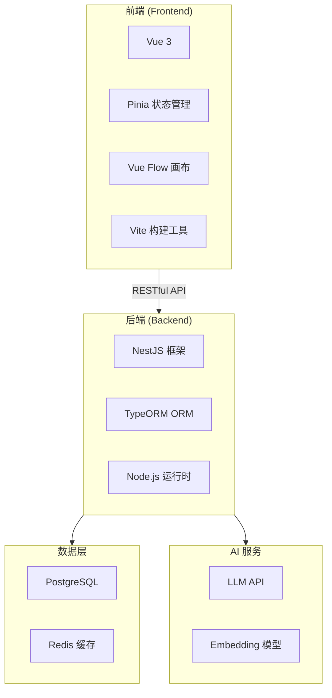
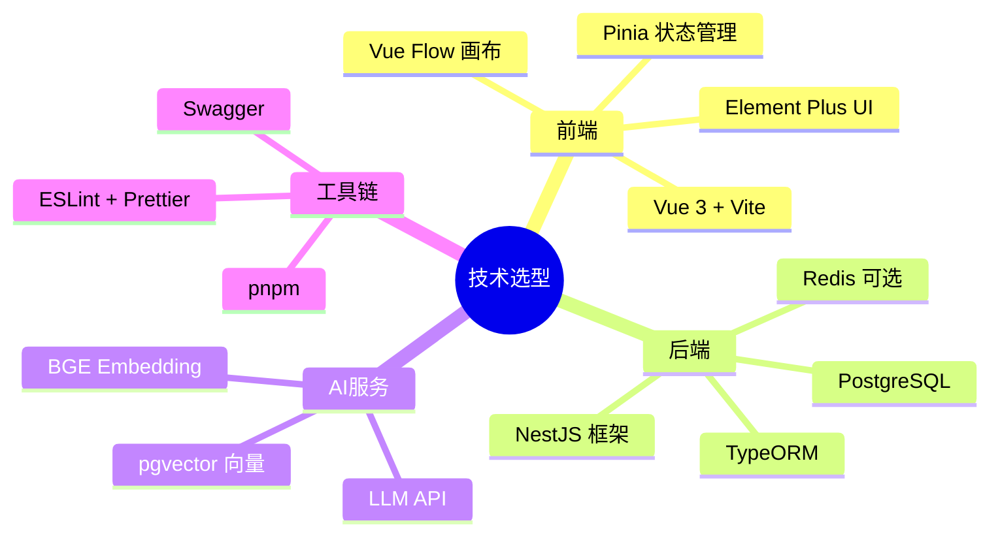

# 简化版 Coze 智能体平台 - 技术选型文档

## 项目概述

打造一个轻量化、高还原度的 Coze 智能体平台 Demo，支持用户通过**可视化拖拽编排**工作流、知识库构建与 RAG 检索，无需复杂编码即可快速搭建智能问答 Agent。

---

## 技术栈总览

---

## 前端技术选型

### 核心框架：Vue 3

| 选型维度       | 分析                                                           |
| -------------- | -------------------------------------------------------------- |
| **选择原因**   | 组合式 API 更灵活，响应式系统性能更优，TypeScript 支持更好     |
| **对比 React** | Vue 3 学习曲线更平缓，模板语法更直观，对于拖拽场景开发效率更高 |
| **版本要求**   | Vue 3.4+                                                       |

### 状态管理：Pinia

| 选型维度      | 分析                                               |
| ------------- | -------------------------------------------------- |
| **选择原因**  | 官方推荐，API 简洁，支持模块化，TypeScript 友好    |
| **对比 Vuex** | Pinia 去除了 mutations，代码更简洁，支持组合式 API |

### 拖拽画布：Vue Flow

| 选型维度     | 分析                                                                  |
| ------------ | --------------------------------------------------------------------- |
| **选择原因** | 专为 Vue 3 设计的节点流程图库，支持自定义节点/边                      |
| **核心能力** | 拖拽连线、缩放平移、节点分组、小地图导航                              |
| **备选方案** | [LogicFlow](https://github.com/didi/LogicFlow) - 滴滴开源，功能更丰富 |

> [!TIP]
> Vue Flow 基于 React Flow 移植，社区活跃，文档完善，适合快速上手。

### 构建工具：Vite

| 选型维度     | 分析                                |
| ------------ | ----------------------------------- |
| **选择原因** | 极速冷启动，热更新快，原生 ESM 支持 |
| **版本要求** | Vite 5.x                            |

### UI 组件库选项

| 组件库              | 推荐场景   | 特点                    |
| ------------------- | ---------- | ----------------------- |
| **Element Plus**    | 企业级应用 | 组件丰富，文档完善      |
| **Naive UI**        | 现代化设计 | TypeScript 优先，性能好 |
| **Arco Design Vue** | 字节风格   | 设计规范统一            |

---

## 后端技术选型

### 框架：NestJS

| 选型维度         | 分析                                                        |
| ---------------- | ----------------------------------------------------------- |
| **选择原因**     | 模块化架构，依赖注入，TypeScript 原生支持，企业级框架       |
| **对比 Express** | NestJS 提供完整的架构约束，代码组织更规范，更适合中大型项目 |
| **核心模块**     | 工作流引擎、知识库服务、Agent 核心服务                      |

> [!NOTE]
> **工程化保障**：后端在保存/更新/执行工作流时进行强校验（WF004），避免绕过前端导致非法流程。该策略与 NestJS 的模块化与全局异常过滤器协同使用，保障一致性与可维护性。

> [!IMPORTANT]
> NestJS 的装饰器模式和模块化设计，非常适合构建复杂的工作流引擎。

### ORM：TypeORM / Prisma

| ORM         | 优势                         | 劣势                   |
| ----------- | ---------------------------- | ---------------------- |
| **TypeORM** | 与 NestJS 集成好，装饰器风格 | 部分高级功能文档不完善 |
| **Prisma**  | 类型安全，迁移工具强大       | 学习曲线略陡           |

### 数据库：PostgreSQL

| 选型维度          | 分析                                               |
| ----------------- | -------------------------------------------------- |
| **选择原因**      | 支持 JSON 存储（工作流定义）、全文搜索、可扩展性强 |
| **pgvector 扩展** | 支持向量存储和相似度搜索，适合 RAG 场景            |

### 缓存：Redis（可选）

| 选型维度     | 分析                                           |
| ------------ | ---------------------------------------------- |
| **使用场景** | 会话缓存、工作流执行状态、频繁访问的知识库片段 |
| **替代方案** | 初期可用内存缓存，后期再引入 Redis             |

---

## AI 服务选型

### LLM 接入

| 服务商        | 推荐模型              | 特点               |
| ------------- | --------------------- | ------------------ |
| **OpenAI**    | GPT-4o / GPT-4o-mini  | 效果最好，成本较高 |
| **Anthropic** | Claude 3.5 Sonnet     | 长上下文支持好     |
| **国内服务**  | 智谱 GLM-4 / 通义千问 | 合规性好，成本低   |

### Embedding 模型

| 方案     | 推荐                           | 说明                 |
| -------- | ------------------------------ | -------------------- |
| **云端** | OpenAI text-embedding-3-small  | 效果好，简单易用     |
| **本地** | BGE-M3 / Sentence Transformers | 无需付费，可离线使用 |

> [!NOTE]
> **检索策略补充**：系统支持混合检索（关键词+向量）与可选重排序（rerank），用于提升召回与相关性。

### 向量数据库选项

| 数据库       | 推荐场景       | 优势                         |
| ------------ | -------------- | ---------------------------- |
| **pgvector** | 数据量 < 100万 | 与 PostgreSQL 统一，运维简单 |
| **Milvus**   | 大规模向量检索 | 高性能，功能丰富             |
| **Chroma**   | 快速原型       | 嵌入式使用简单               |

---

## 开发工具链

### 必备工具

| 类别         | 工具                  | 用途              |
| ------------ | --------------------- | ----------------- |
| **包管理**   | pnpm                  | 高效的依赖管理    |
| **代码规范** | ESLint + Prettier     | 代码风格统一      |
| **API 文档** | Swagger (NestJS 内置) | 自动生成 API 文档 |
| **版本控制** | Git + GitHub/GitLab   | 代码版本管理      |

### 推荐 AI 辅助工具

| 工具                  | 用途         |
| --------------------- | ------------ |
| **Cursor / Windsurf** | AI 辅助编码  |
| **Claude / ChatGPT**  | 架构设计讨论 |

---

## 选型决策总结

> [!CAUTION]
> **技术栈不是越多越好！** 作为 Demo 项目，应该聚焦核心功能，避免过度工程化。优先保证「编排-执行-反馈」和「知识-检索-生成」两个核心闭环的完整实现。

---

## 版本要求汇总

| 技术       | 版本要求  |
| ---------- | --------- |
| Node.js    | 18.x LTS+ |
| Vue        | 3.4+      |
| Vite       | 5.x       |
| NestJS     | 10.x      |
| PostgreSQL | 15+       |
| TypeScript | 5.x       |
